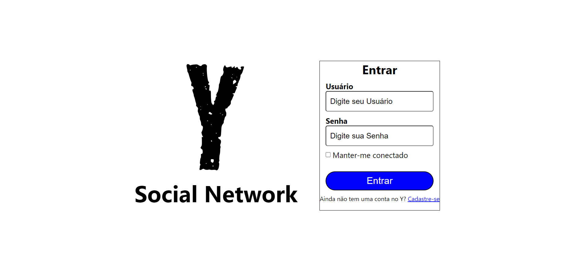

<div align="center">

</div>


### [View the Brazilian Portuguese version](README.pt_BR.md)


# Y Social Network


**Y Social Network** is a microblogging network project inspired by X/Twitter, integrating both frontend and backend into a complete application. Developed as part of my studies in Node.js and React, this project aims to create a platform where users can post, like, repost, and interact in a dynamic social feed.

The application uses modern technologies to ensure security and an enhanced user experience:

- On the **backend**, implemented with Node.js and Sequelize, advanced security practices are adopted, including JWT authentication with two tokens, password hashing, and providing an extra layer of protection for users
- On the **frontend**, built with React, the interface is responsive, supports image uploads using the ImgBB API, and includes both light and dark themes for a personalized experience.

This project reflects my learning and practice with modern development technologies to create a robust and secure social network.

---

### Prerequisites

Before starting, make sure you have the following items installed:

- **PostgreSQL Database** (local or remote): The project currently uses PostgreSQL for data storage. In the future, it will be updated to support other databases.
- **Node.js** version 20.10 or higher.

---

### Step-by-Step to Run the Project


#### 1. Set Up and Start the Backend

1. Open a terminal and navigate to the backend folder:

   ```bash
   cd backend
   ```

2. Rename the `.env.example` file to `.env` and fill in the environment variables as instructed in the file.

3. Install the necessary dependencies:

   ```bash
   npm install
   ```

4. Run the setup script to configure the database and other initial dependencies:

   ```bash
   npm run setup
   ```

5. (Optional) If you want to populate the database with example data, you can run:

   ```bash
   npm run seed
   ```

6. Start the backend server:

   ```bash
   npm start
   ```

   The backend will be running and ready to receive requests.

#### 2. Set Up and Start the Frontend

1. In a new terminal window, navigate to the frontend folder:

   ```bash
   cd front
   ```

2. Rename the `.env.example` file to `.env` and fill in the environment variables as needed.

3. Install the frontend dependencies:

   ```bash
   npm install
   ```

4. Start the frontend server:

   ```bash
   npm start
   ```

   Now, the frontend will be running, and you can access the project through your browser.


After these steps, the project will be ready for use and local testing.


## Screenshots

<div style="display: flex; flex-wrap: wrap; justify-content: center;" >



</div>


## Future Implementations

Here are some features and improvements planned for the future of the project:

- **Mobile App (Flutter)**: A mobile app developed with Flutter will be created to provide users with seamless access to the platform on their smartphones, offering the ability to interact with posts and notifications on the go.
  
- **Alexa Skill**: A voice-controlled Alexa skill will be developed to allow users to track their follower count, make new posts, and interact with the platform using voice commands. This will make the platform even more accessible for users who prefer hands-free operation.

These are just a few ideas for future updates, and new features may be added as the project evolves.

## License

[](https://www.gnu.org/licenses/agpl-3.0)

