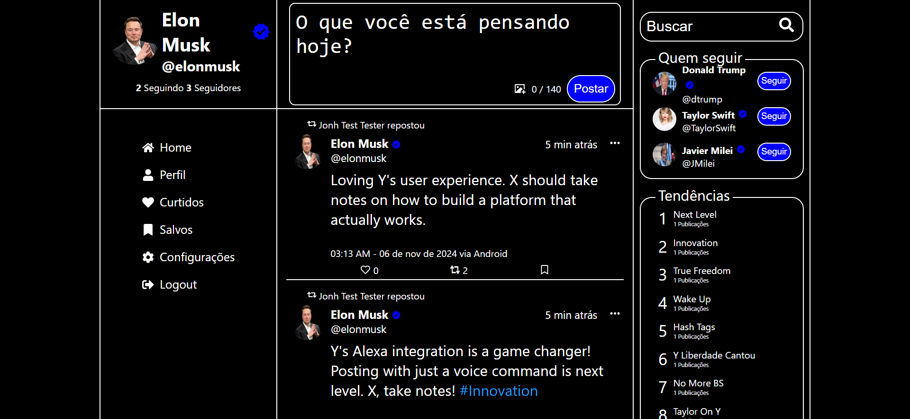
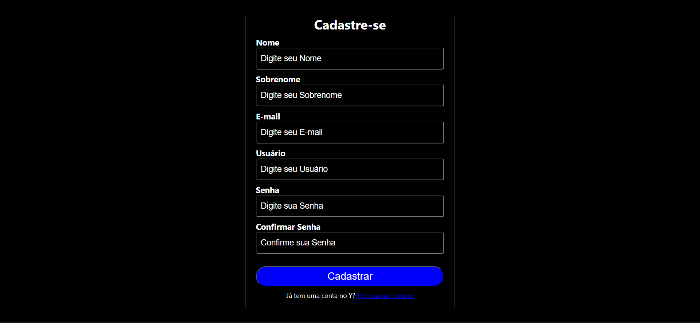

<div align="center">

</div>

### [View the Brazilian Portuguese version](README.pt_BR.md)

# Y Social Network

**Y Social Network** is a microblogging network project inspired by X/Twitter, integrating both frontend and backend into a complete application. Developed as part of my studies in Node.js and React, this project aims to create a platform where users can post, like, repost, and interact in a dynamic social feed.

The application uses modern technologies to ensure security, scalability, and an enhanced user experience:

- On the **backend**, implemented with Node.js and Sequelize, advanced security practices have been adopted, including JWT authentication with two tokens, password hashing, and other measures, providing an extra layer of protection for users.
- On the **frontend**, built with React, the interface is responsive, supports image uploads using the ImgBB API, and includes both light and dark themes for a personalized experience.
- **Docker** Integration: The project includes a Docker-based solution, allowing the entire application (frontend, backend, and database) to run seamlessly in isolated containers. This ensures a consistent development and deployment environment, making setup easier and improving maintainability.

This project reflects my learning and practice with modern development technologies to create a robust and secure social network.

---

### Prerequisites

Before starting, make sure you have the following installed:

- **PostgreSQL Database** (local or remote): The project currently uses PostgreSQL for data storage. In the future, support for other databases will be added.
- **Node.js** version 20.10 or higher.

---

### Step-by-Step Guide to Run the Project

#### 1. Set Up and Start the Backend

1. Open a terminal and navigate to the backend folder:

   ```bash
   cd backend
   ```

2. Rename the `.env.example` file to `.env` and fill in the environment variables as instructed in the file, including the database password.

3. Install the necessary dependencies:

   ```bash
   npm install
   ```

4. Run the setup script to configure the database and other initial dependencies:

   ```bash
   npm run setup
   ```

5. (Optional) If you want to populate the database with example data, you can run:

   ```bash
   npm run seed
   ```

6. Start the backend server:

   ```bash
   npm start
   ```

   The backend will be running and ready to receive requests.

#### 2. Set Up and Start the Frontend

1. Open a new terminal window and navigate to the frontend folder:

   ```bash
   cd front
   ```

2. Rename the `.env.example` file to `.env` and fill in the environment variables as needed. If running without Docker, include:

   ```bash
   REACT_APP_APIURL = http://localhost:3001
   ```

3. Install the frontend dependencies:

   ```bash
   npm install
   ```

4. Start the frontend server:

   ```bash
   npm start
   ```

   The frontend will now be running, and you can access the project through your browser.

#### 3. Running the Project with Docker

If you prefer using Docker to run the project, follow these steps:

1. Ensure that Docker and Docker Compose are installed on your machine.
2. Rename the `.env.example` file to `.env` and fill in the environment variables as instructed, including the database password.
3. In the `docker-compose.yml` file, verify that the database password matches the one defined in the backend's `.env` file.

4. In the backend's `.env` file, set:

   ```bash
   DB_HOST = db
   ```

5. In the frontend's `.env` file, set:

   ```bash
   REACT_APP_APIURL = http://backend:3001
   ```

6. In the terminal, run the following command at the project root:

   ```bash
   docker compose up -d
   ```

7. Wait until all containers are running.
8. The backend will be available at `http://localhost:3001` and the frontend at `http://localhost:3000`.

After completing these steps, the project will be ready for use and local testing.

---

## Screenshots

<div align="center" style="display: flex; flex-wrap: wrap; justify-content: center;">




</div>

---

## Future Implementations

Here are some features and improvements planned for future updates:

- **Mobile App (Flutter)**: A mobile app developed with Flutter will be created, allowing users to interact with posts and notifications conveniently from their smartphones.
  
- **Alexa Skill**: A voice-controlled Alexa skill will be developed, enabling users to track their follower count, create new posts, and interact with the platform using voice commands. This will enhance accessibility for hands-free users.

These are just a few ideas for upcoming updates, and new features may be added as the project evolves.

---

## License

[](https://www.gnu.org/licenses/agpl-3.0)
