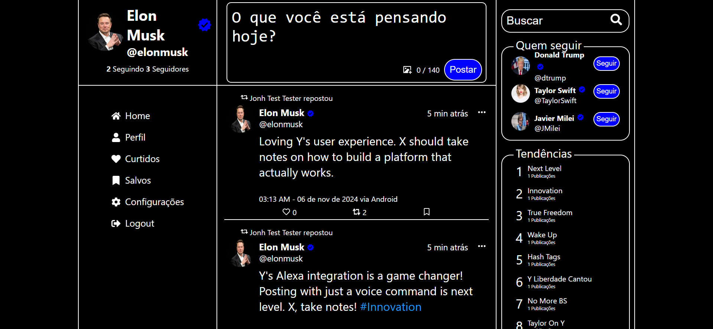
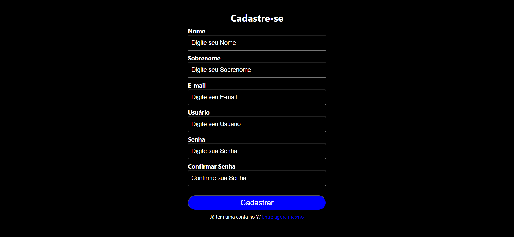
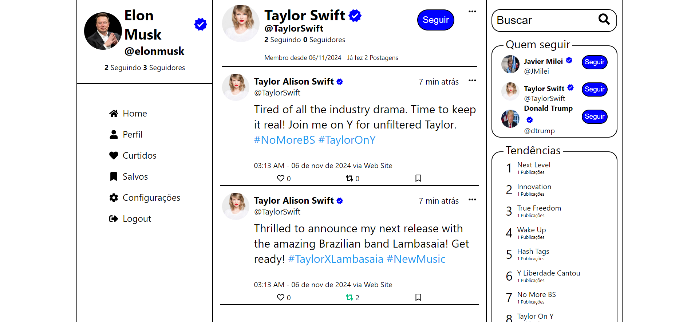

<div align="center">

<div/>
<div align="left"/>


### [Ver a versão em Inglês](README.md)

# Y Social Network

**Y Social Network** é um projeto de rede de microblogging inspirado no X/Twitter, que integra frontend e backend em uma aplicação completa. Desenvolvido como parte dos meus estudos em Node.js e React, este projeto visa criar uma plataforma onde os usuários podem postar, curtir, repostar e interagir em um feed social dinâmico.

A aplicação utiliza tecnologias modernas para garantir segurança e uma experiência de usuário aprimorada:

- No **backend**, implementado com Node.js e Sequelize, foram adotadas práticas avançadas de segurança, incluindo autenticação JWT com dois tokens, hash de senhas e outras medidas, oferecendo uma camada extra de proteção para os usuários.
- No **frontend**, construído com React, a interface é responsiva, permite o upload de imagens usando a API do ImgBB e oferece suporte a temas claro e escuro para uma experiência personalizada.

Esse projeto reflete o aprendizado e a prática com tecnologias de desenvolvimento modernas para criar uma rede social robusta e segura.

---

### Pré-requisitos

Antes de iniciar, certifique-se de que você possui os seguintes itens instalados:

- **Banco de Dados PostgreSQL** (local ou remoto): O projeto atualmente utiliza PostgreSQL para armazenamento de dados. No futuro, ele será atualizado para oferecer suporte a outros bancos de dados.
- **Node.js** na versão 20.10 ou superior.

---

### Passo a Passo para Executar o Projeto


#### 1. Configurar e Iniciar o Backend

1. Abra o terminal e navegue até a pasta do backend:

   ```bash
   cd backend
   ```

2. Renomeie o arquivo `.env.example` para `.env` e preencha as variáveis de ambiente conforme as instruções no próprio arquivo.

3. Instale as dependências necessárias:

   ```bash
   npm install
   ```

4. Execute o script de setup para configurar o banco de dados e outras dependências iniciais:

   ```bash
   npm run setup
   ```

5. (Optional) Se você quiser popular o banco de dados com dados de exemplo, pode executar:

   ```bash
   npm run setup
   ```

6. Inicie o servidor backend:

   ```bash
   npm start
   ```

   O backend estará em execução e pronto para receber requisições.

#### 2. Configurar e Iniciar o Frontend

1. Em uma nova janela de terminal, navegue até a pasta do frontend:

   ```bash
   cd front
   ```

2. Renomeie o arquivo `.env.example` para `.env` e preencha as variáveis de ambiente conforme necessário.

3. Instale as dependências do frontend:

   ```bash
   npm install
   ```

4. Inicie o servidor frontend:

   ```bash
   npm start
   ```

   Agora, o frontend estará em execução, e você poderá acessar o projeto através do navegador.


Após esses passos, o projeto estará pronto para uso e testes locais.


## Capturas de Tela

<div style="display: flex; flex-wrap: wrap; justify-content: center;" >




</div>


## Implementações Futuras

Aqui estão alguns recursos e melhorias planejados para o futuro do projeto:

- **Aplicativo Mobile (Flutter)**: Será criado um aplicativo mobile desenvolvido com Flutter para proporcionar aos usuários acesso contínuo à plataforma em seus smartphones, permitindo a interação com postagens e notificações de maneira prática e em qualquer lugar.

- **Skill para Alexa**: Será desenvolvida uma skill para Alexa que permitirá aos usuários acompanhar o número de seguidores, fazer novas postagens e interagir com a plataforma por meio de comandos de voz. Isso tornará a plataforma ainda mais acessível para usuários que preferem operar de maneira mãos-livres.

Essas são apenas algumas ideias para futuras atualizações, e novos recursos podem ser adicionados conforme o projeto evolui.

## Licença

[](https://www.gnu.org/licenses/agpl-3.0)